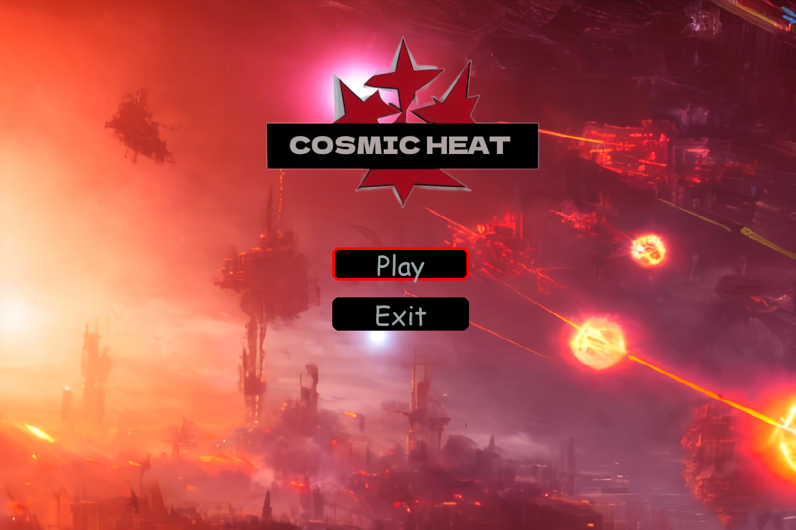
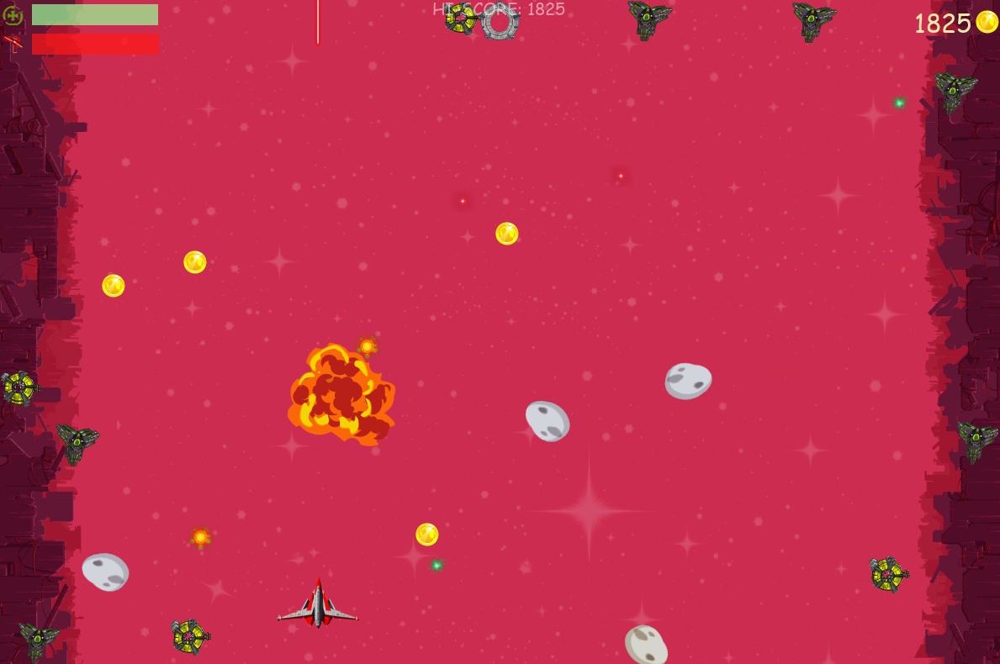
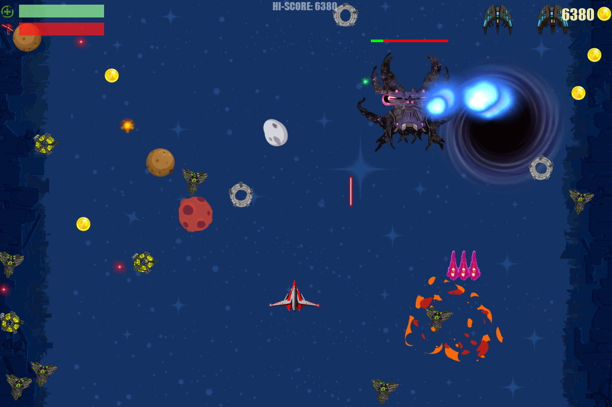
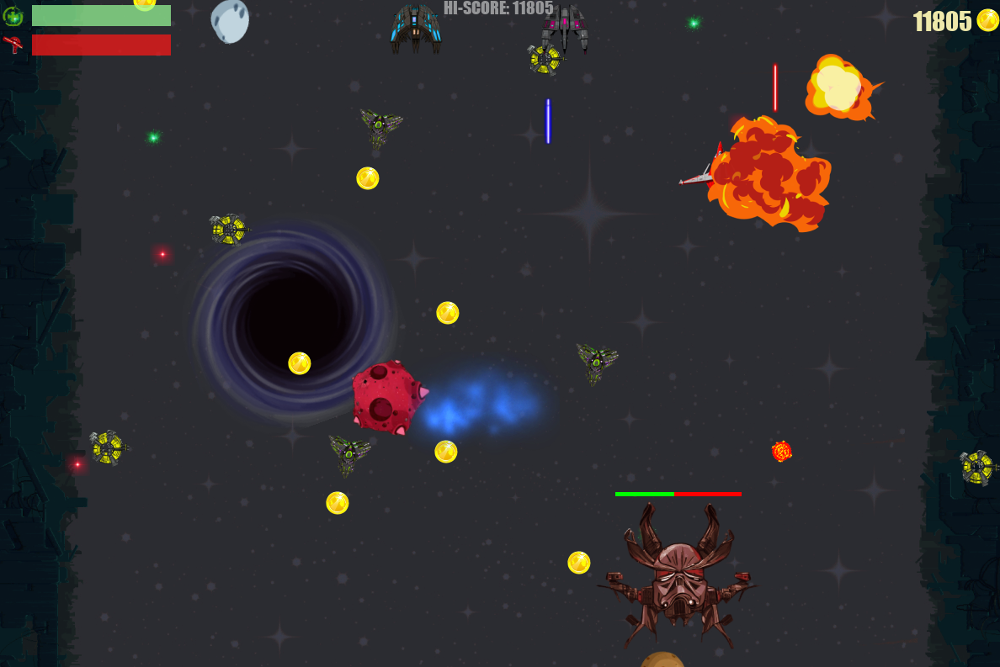
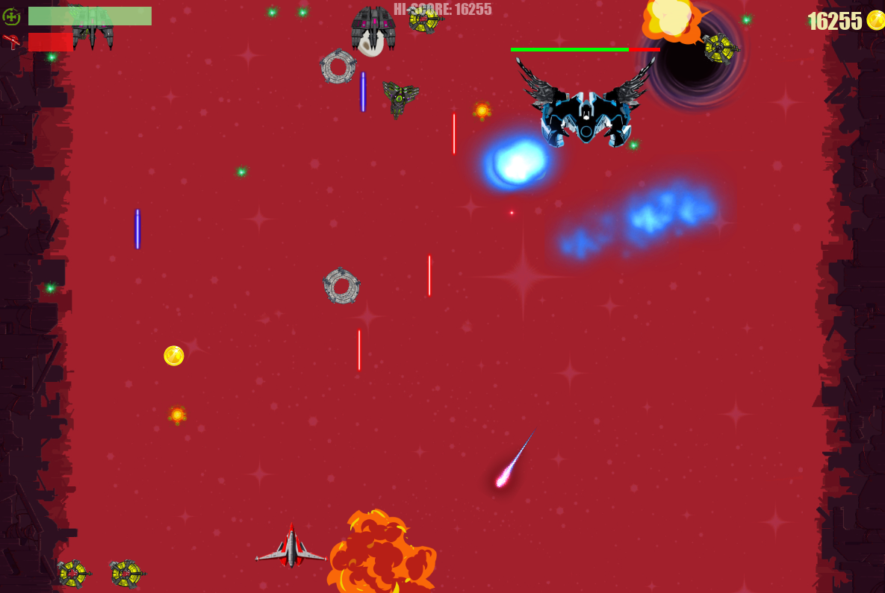

# Cosmic Heat
Just a 2D space shooter from a neighboring parallel world. It was written using Python and Pygame. The game is still being updated. To control the player, you can use either the keyboard or a joystick. The game features a variety of cool bosses and enemies that will challenge your skills and keep you engaged. Get ready to blast your way through waves of enemy ships and take on epic boss battles in this exciting space adventure!
## Game launch:
 - git clone https://github.com/Dave-YP/cosmic-heat-pygame.git
 - cd cosmic-heat-pygame
 - python -m venv env
 - source env/Scripts/activate
 - pip install -r requirements.txt
 - python main.py

 ## Controls:
 - shoot - SPACE
 - move - arrows
 - pause - P
 - exit - Esc

## Gameplay

## Images

